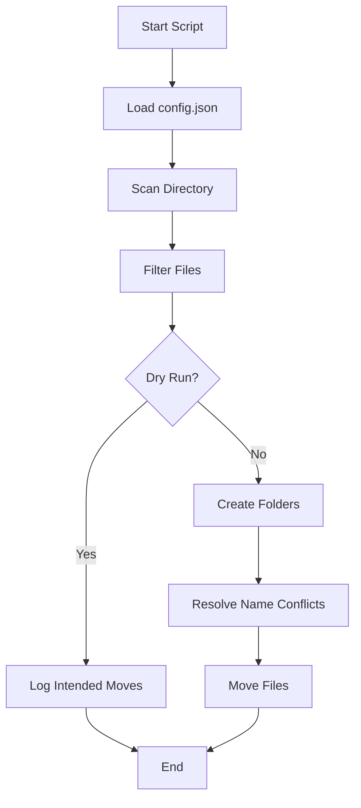

# 📂 Smart File Organizer (CLI)


---

## 🚀 Overview

A **powerful, safe, and configurable CLI tool** that automatically organizes files in a directory based on their file types.

✔ Uses a **JSON config file** (fully customizable)
✔ Supports **Dry Run mode** (safe preview)
✔ Displays **live progress bar**
✔ Handles **file name conflicts intelligently**
✔ Provides **detailed logging**

---

## 🎯 Features

* ⚙️ Config-driven categorization (no hardcoding)
* 🔍 Dry-run simulation before execution
* 📊 Real-time progress bar using `tqdm`
* 🛡️ Safe file operations with error handling
* 🔁 Automatic conflict resolution (`file (1).txt`)
* 🧾 Logging to file + console

---

## 🧠 How It Works



---

## 📁 Project Structure

```
📦 file-organizer
 ┣ 📜 organizer.py
 ┣ 📜 config.json
 ┣ 📜 organizer.log
 ┗ 📜 README.md
```

---

## ⚙️ Configuration (`config.json`)

Customize file organization without touching Python code:

```json
{
  "Images": [".jpg", ".jpeg", ".png", ".gif"],
  "Documents": [".pdf", ".docx", ".txt"],
  "Audio": [".mp3", ".wav"],
  "Video": [".mp4", ".mkv"],
  "Archives": [".zip", ".rar"]
}
```

---

## 🖥️ Usage

### ▶️ Run Normally (Live Mode)

```bash
python organizer.py /path/to/directory
```

### 🧪 Dry Run (Safe Mode)

```bash
python organizer.py /path/to/directory --dry-run
```

---

## 📊 Example Output

```
--- DRY RUN MODE ENABLED ---
[DRY RUN] Would move 'photo.jpg' -> '/Images/photo.jpg'
[DRY RUN] Would move 'report.pdf' -> '/Documents/report.pdf'
```

```
--- LIVE RUN MODE ENABLED ---
Moved: 'song.mp3' -> '/Audio/song.mp3'
Moved: 'video.mp4' -> '/Video/video.mp4'
```

---

## 📈 Progress Bar

```
Organizing Files: 100%|██████████| 150/150 [00:02<00:00, 75.00it/s]
```

---

## ⚠️ Safety Features

* No changes in **dry-run mode**
* Prevents overwriting files
* Handles permission errors gracefully
* Logs everything for traceability

---

## 📝 Logging

Logs are stored in:

```
organizer.log
```

Includes:

* File movements
* Errors
* Conflicts
* Execution mode

---

## 🧪 Example Before & After

### Before

```
Downloads/
 ┣ photo.jpg
 ┣ video.mp4
 ┣ report.pdf
```

### After

```
Downloads/
 ┣ Images/
 ┃ ┗ photo.jpg
 ┣ Video/
 ┃ ┗ video.mp4
 ┣ Documents/
   ┗ report.pdf
```

---

## 🔧 Installation

```bash
pip install tqdm
```

---

## 💡 Future Improvements

* Recursive folder support
* GUI version
* File size/date-based sorting
* Cloud sync integration

---

## 🤝 Contributing

Pull requests are welcome. For major changes, open an issue first.

---

## 📜 License

MIT License

---

## 👨‍💻 Author

**Sushobhit Chattaraj**

---

## ⭐ If you like this project

Give it a star ⭐ on GitHub — it helps a lot!
